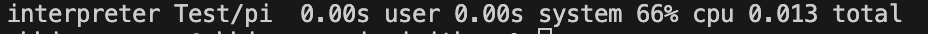

<div align="center" style="display:grid;place-items:center;">
<p>
    <a href="https://www.youtube.com/watch?v=4CcsI82OGq0" target="_blank"></a>
</p>
<h1>JAITHON</h1>

[YT Video](https://www.youtube.com/watch?v=4CcsI82OGq0) | [Docs](https://github.com/abhiramasonny/jaithon/blob/main/Documentation/grammar.txt)
</div>

***We suffer so that you don't***
<br>
<br>
This is a simple compiler/interpreter that supports array declarations and operations. It can parse and execute code containing array declarations, variable assignments, print statements, import statements, input statements, time functions, and much more. The objective behind this interpreter is to provide a fun and easy way to get introduced to programming.

### Description

**JAITHON**: *A Simple Introduction to Math and Programming*

JAITHON is a programming language put together for the purpose of teaching children and/or adults the basics of programming. Its simplicity and intuitive syntax make it an ideal choice for young learners, allowing them to grasp programming concepts easily and enjoyably. Jaithon's syntax is so simple, that its basically like reading/writing english. All you need is a 1st grade education (Just know english...) to be able to enjoy my language. By providing a beginner-friendly environment, Jaithon removes the tech-savvy knowledge needed with 'normal'/highlevel programming languages, making it accessible to people with little or no prior programming experience. The intended use of my language is to help the transition to Python. JAITHON will help you get from complete beginner, to having a basic grasp of python syntax.

**Crossing the age barrier**

The primary problem JAITHON addresses is the stress often felt by young learners when approaching programming. As a quote from Munna Bhai MBBS, *"Bhai, tension nahin lene ka bhai!"*, meaning leave the tension behind. By offering straightforward and visually appealing syntax, JAITHON enables children to effectively *leave the tension behind*. This approach cultivates a positive learning experience, encouraging children to explore and develop problem-solving skills, logical thinking, and computational creativity from an early age. Our syntax is structured in such a way, that anyone who reads it will be able to tell you what the program does. Ive got proof for that as well. Star the GH repo and ill tell it to you :DD.

## Usage

To use the array compiler/interpreter on UNIX, follow these steps:
```bash 
git clone https://github.com/abhiramasonny/jaithon
cd jaithon
chmod +x start.sh
./start.sh
```
**You must have gcc and Make installed otherwise the script wont work.**
Then type this as follow up to *Enter file name to interpret*

```
jaithon
```

Or you can run 
```bash
./interpreter filename
```

4. Create a new file with the .jai extension, then write code in the JAI language.
5. Execute the compiler/interpreter with *filename* as input.
6. The programs output will be displayed.
7. In the top of the interpreter.c file, there is a variable called debug. Turning that off gives the full intended user experience.
8. If you do this, you will need to run **./start.sh** again, to recompile the binary.

### Path

The way you create the jaithon path, is that you run ./configure.sh **Folder where this code is stored**

For example; ./configure.sh Users/abhiramasonny/developer/C/jaithon

Then you can open any terminal window and use the interpreter command to interpret any jaithon code in your computer.
For example...
```bash
interpreter
```
in any directory would work.
## Features

- Variable Assignment: You can assign values to variables using the var keyword. Syntax: *var x = 5*
- String: You can do strings by doing same as variable but with Quotes. Sytnax: *var hi = "hello world"*
- Array Declaration: You can init arrays using the array keyword. Syntax: *array arr = [1]*
- Array Element Modification: You can modify elements of an array using the dot notation. Syntax: *arr.add(0, 4).*
- Print Statement: You can use the print keyword to print values to the console. Syntax: *print x*
- Mathematical Expressions: You can perform arithmetic operations (+, -, *, /) on numbers.
- Comparisons: you can preform comparisons by using the > and < symbols. Syntax: *var a = 1>4* >> the output would be a = 0 because that statement is false.
- Parentheses: You can use parentheses to group expressions and control operator precedence. *PEMDAS*
- Trigonometric Functions: You can use trigonometric functions such as sin, cos, tan, asin, acos, atan, sqrt. Syntax: *math.sin(3)* *math.sin(x)*
- Detecting User input: You can detect user input. Syntax: *input variable_name*
- Time: You can access the users internal Clock by using the time keyword. Syntax: *var t = time()* This saves the time as an integer.
- Comments: You can add comments using the # symbol. Commented lines are displayed in green.
- If loops: You can do if loops by using the if/then/do keywords. Syntax: *if 1>4 then do print 1*
- Not: You can do not operations by using the not keyword. Syntax: *var a = 1 not*
- Quadratic function: You can solve quadratic functions using the inbuilt math function. Syntax: *var q = math.quad(1,2,1)*
- The rest of the functions/keywords/things are located in the documentation.


For more documentation, visit

```
Documentation/grammar.txt
```

**NOTE** Jaithon is actually Faster then its counterpart Python! Here are the reasults from the tests I ran.
<a href="Imgs/JaithonResult.png" target="_blank"></a>
<a href="Imgs/PythonResult.png" target="_blank"></a>
Please Note, the 0.05 user time in python is not 'user' input. It can not be avoided. You can try the speed command on your UNIX running computer with

```bash
time ./interpreter filename
```
<br>

## Flowchart: JAI Programming Language Interpreter

1. **Read Input Code**: Read the code to be compiled/interpreted.
2. **Initialize Token List**: Convert the input code into tokens.
3. **Initialize Variables and Arrays**: Initialize storage for values.
4. **Start Parsing Program**: Begin parsing the program.
5. **Are Tokens Remaining Loop:**: Loop while tokens exist, otherwise GOTO 22.
6. **If Array Declaration**: Parse and store array details.
7. **Parse Array Declaration**: Read array size and elements.
8. **Identifier Check**: Handle variable assignment and print statements.
9. **If Array**: Parse array access or variable assignment.
10. **Parse Variable Assignment**: Assign variable a value.
11. **If Print Statement**: Parse and display variable/expression value.
12. **Parse Print Statement**: Evaluate and print.
13. **If Input Statement**: Parse and read user input.
14. **Parse Input Statement**: Read and store user's input value.
15. **If Trigonometric Function**: Parse and compute trigonometric value.
16. **Parse Trigonometric Function**: Calculate the trigonometric value.
17. **If Time Function**: Parse and compute time-related value.
18. **Parse Time Function**: Calculate the time-related value.
19. **End of loop**: Continue processing remaining tokens. GOTO 5 (Loop back).
20. **All Tokens Processed**: Execution complete, proceed to the end.
21. **Error Handling**: Handle parsing errors or undefined variables/arrays.
22. **Stop**: End the interpreter's execution.

## Syntax Highlighting

This is a really cool feature and takes like 3 seconds to do so don't be lazy and follow the steps.
*Only if you have VS-Code as your IDE*
```sh
cd Extensions
cp -r jai ~/.vscode/extensions
```
**Reload VS-Code**
Note: this is for mac/linux.
<br>
Hasn't been tested on windows

## Examples

Examples are located in the Test directory. There is also documentation of the syntax located at
```
Documentation/grammar.txt
```

## Info
For more info *and to appreciate my hard webdev work* go to the html page located at 
```
https://abhiramasonny.github.io/Projects/JAITHON%20website/index.html
```
or the youtube video
```
https://www.youtube.com/watch?v=4CcsI82OGq0
```
or contact me at abhirama.sonny@gmail.com.