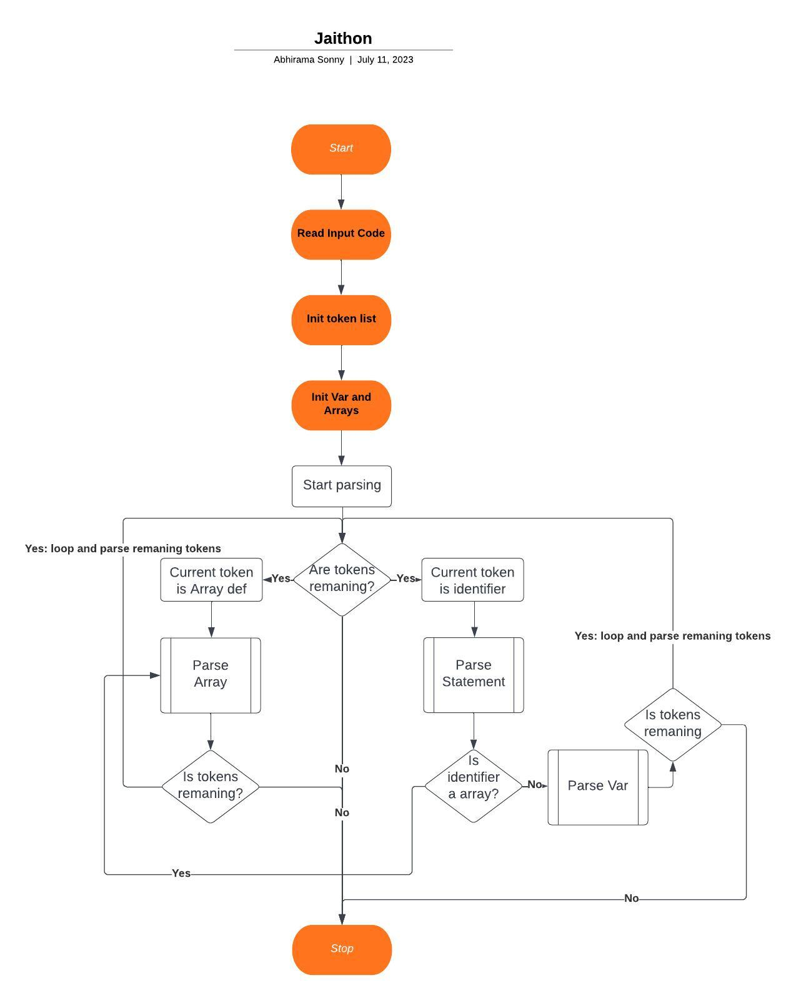

# Jaithon

This is a simple compiler/interpreter that supports array declarations and operations. It can parse and execute code containing array declarations, variable assignments, and print statements.

## Features

- Array Declarations: Define arrays and specify their sizes.
- Array Access: Access elements of an array using square brackets.
- Array Modification: Add elements to an array at specific positions.

## How it Works

The compiler/interpreter follows the following workflow:


1. **Read Input Code**: Read the code to be compiled/interpreted.
2. **Initialize Token List**: Initialize the list of tokens by converting the input code into individual tokens.
3. **Initialize Variables and Arrays**: Set up variables and arrays to store values during execution.
4. **Start Parsing Program**: Begin parsing the program by checking if there are remaining tokens.
5. **Are Tokens Remaining?**: If there are remaining tokens, proceed to the next step. Otherwise, go to step 14.
6. **Current Token is an Array Declaration**: If the current token is an array declaration, parse it and store the array's name and size.
7. **Parse Array Declaration**: Parse the array declaration statement.
8. **Current Token is an Identifier**: If the current token is an identifier, check if it corresponds to an array declaration.
9. **Check Identifier is an Array**: If the identifier is an array, proceed to parse the statement related to array access or modification. Otherwise, go to step 10
10. **Parse Statement**: Parse the variable assignment or print statement.
11. **Loop through Tokens**: Continue looping through the remaining tokens in the program.
12. **All Tokens Processed**: If all tokens have been processed, go to step 14.
13. **Parse Variable Assignment**: If the identifier is not an array, parse the variable assignment statement.
14. **Stop**: End the execution of the compiler/interpreter.

## Usage

To use the array compiler/interpreter, follow these steps:

1. Provide the code to be compiled/interpreted, including array declarations, variable assignments, and print statements.
2. Execute the compiler/interpreter.
3. The output will be displayed, showing the results of any print statements or errors encountered during execution.

## Examples

Here are some examples of code that can be compiled/interpreted using this array compiler/interpreter:

```c
array a = [3]
print a
//Output: [0.000000, 0.000000, 0.000000] as there are 3 spots in memory initilized to 0.
a.add(0, 2)
print a
//Output: [2.000000, 0.000000, 0.000000] as the 0th term is set to 2
var x = 5
print x
//Output: 5.000000
```