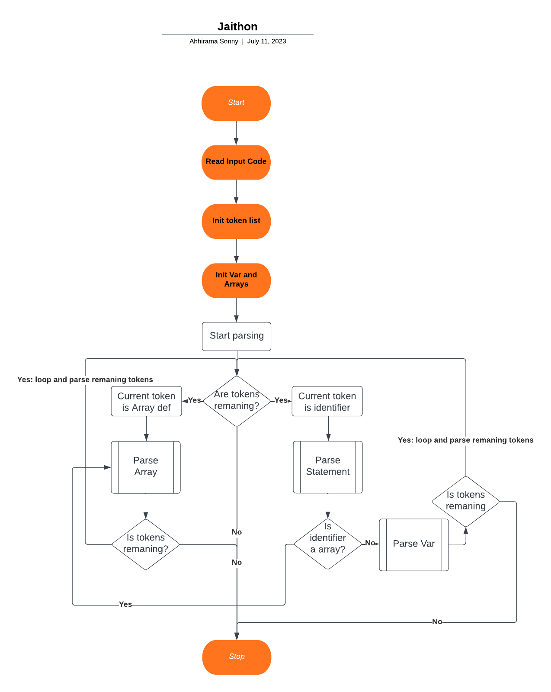

# Jaithon

This is a simple compiler/interpreter that supports array declarations and operations. It can parse and execute code containing array declarations, variable assignments, and print statements.

## Features

- Variable Assignment: You can assign values to variables using the var keyword, e.g., var x = 5.
- Array Declaration: You can init arrays using the array keyword, e.g., array arr = [1].
- Array Element Modification: You can modify elements of an array using the dot notation, e.g., arr.add(0, 4).
- Print Statement: You can use the print keyword to print values to the console, e.g., print x.
- Mathematical Expressions: You can perform arithmetic operations (+, -, *, /) on numbers.
- Parentheses: You can use parentheses to group expressions and control operator precedence.
- Trigonometric Functions: You can use trigonometric functions such as sin, cos, tan, asin, acos, atan, sqrt.
- Comments: You can add comments using the # symbol. Commented lines are displayed in green.


## How it Works

The compiler/interpreter follows the following workflow:


1. **Read Input Code**: Read the code to be compiled/interpreted.
2. **Initialize Token List**: Initialize the list of tokens by converting the input code into individual tokens.
3. **Initialize Variables and Arrays**: Set up variables and arrays to store values during execution.
4. **Start Parsing Program**: Begin parsing the program by checking if there are remaining tokens.
5. **Are Tokens Remaining?**: If there are remaining tokens, proceed to the next step. Otherwise, go to step 14.
6. **Current Token is an Array Declaration**: If the current token is an array declaration, parse it and store the array's name and size.
7. **Parse Array Declaration**: Parse the array declaration statement.
8. **Current Token is an Identifier**: If the current token is an identifier, check if it corresponds to an array declaration.
9. **Check Identifier is an Array**: If the identifier is an array, proceed to parse the statement related to array access or modification. Otherwise, go to step 10
10. **Parse Statement**: Parse the variable assignment or print statement.
11. **Loop through Tokens**: Continue looping through the remaining tokens in the program.
12. **All Tokens Processed**: If all tokens have been processed, go to step 14.
13. **Parse Variable Assignment**: If the identifier is not an array, parse the variable assignment statement.
14. **Stop**: End the execution of the compiler/interpreter.

## Usage

To use the array compiler/interpreter, follow these steps:
1. cd into project directory 
2. 
```bash 
gcc -o interpreter interpreter.c 
```

3.
``` bash
./interpreter
```
4. OPTIONAL: Write the code to be compiled/interpreted, including array declarations, variable assignments, and print statements to the file called jaithon.jai.
the jaithon.jai file is the file that the interpreter reads from. It by default has test cases.
5. Execute the compiler/interpreter.
6. The output will be displayed, showing the results of any print statements or errors encountered during execution.


## Syntex Highlighting

This is a really cool feature and takes like 3 seconds to do so dont be lazy and follow the steps
```sh
cd tmp
cp -r jai ~/.vscode/extensions
```
**Reload**
Note: this is for mac
if you have windows just figure it out lol
## Examples

Here are some examples of code that can be compiled/interpreted using this interpreter:

```python
array a = [3]
print a
# Output: [0.000000, 0.000000, 0.000000] as there are 3 spots in memory initilized to 0.
a.add(0, 2)
print a
# Output: [2.000000, 0.000000, 0.000000] as the 0th term is set to 2
var x = 5
print x
# Output: 5.000000
```
